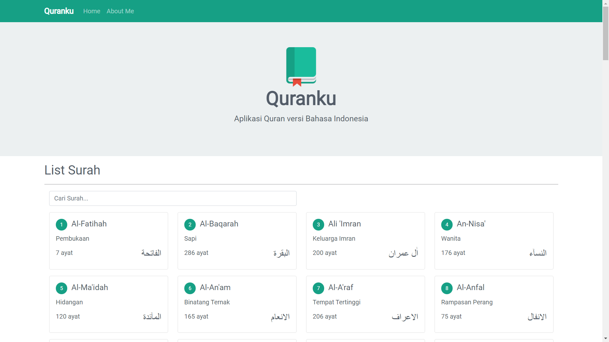

# Quranku - Aplikasi Quran Versi Bahasa Indonesia



## About this project:

---

- Project Name : quranku
- Database Name : -
- Project type : Frontend Web
- Information : Project web apilkasi quran sederhana dengan Reactjs
- Web URL: [webquranku.vercel.app](https://webquranku.vercel.app/)

---

## Feature

- List Semua surah
- List ayat surah beserta terjemahan
- Audio di setiap surah

## Installation

Note : pastikan di komputer anda sudah terinstall nodejs, git dan yarn (optional)

- Clone repository

```
git clone https://github.com/giannurwana19/quranku.git
```

- Jalan kan perintah `npm install` atau `yarn`

```
npm install
```

atau dengan yarn

```
yarn
```

- Menjalankan aplikasi

```
npm start
```

atau dengan yarn

```
yarn start
```

Project akan berjalan di http://localhost:3000

Masih banyak fitur yang mungkin akan dikembangkan kedepan.

kontribusi teman-teman sangat berarti untuk membangun aplikasi quranku menjadi lebih baik lagi.

_Have a Great Day_

**Gian Nurwana**
